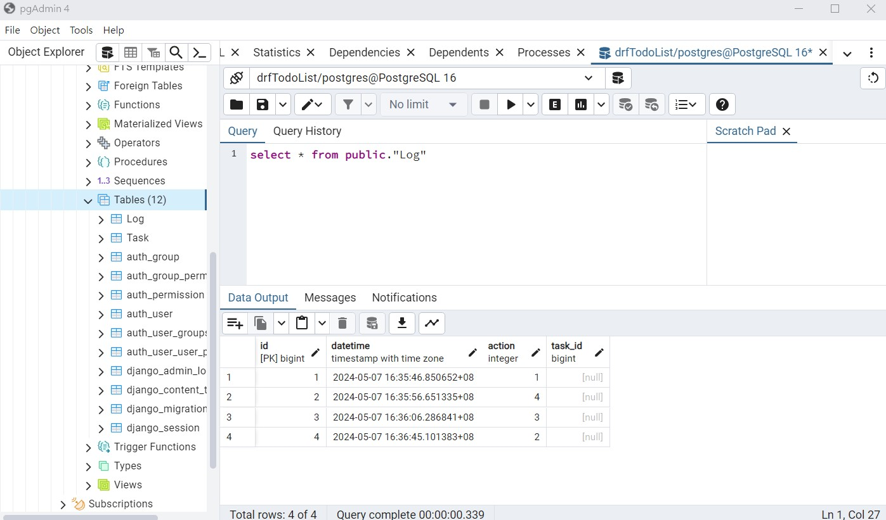

# Django-REST-framework
1st Project: drfToDoList  
Follow CRUD operations in Django Rest Framework to make To-Do List API  

2nd Project: drfLessonDetail  
Assume the bookstore propose a process to hit the sotre shelves. Bookstore need to follow the process and put at the right place.   